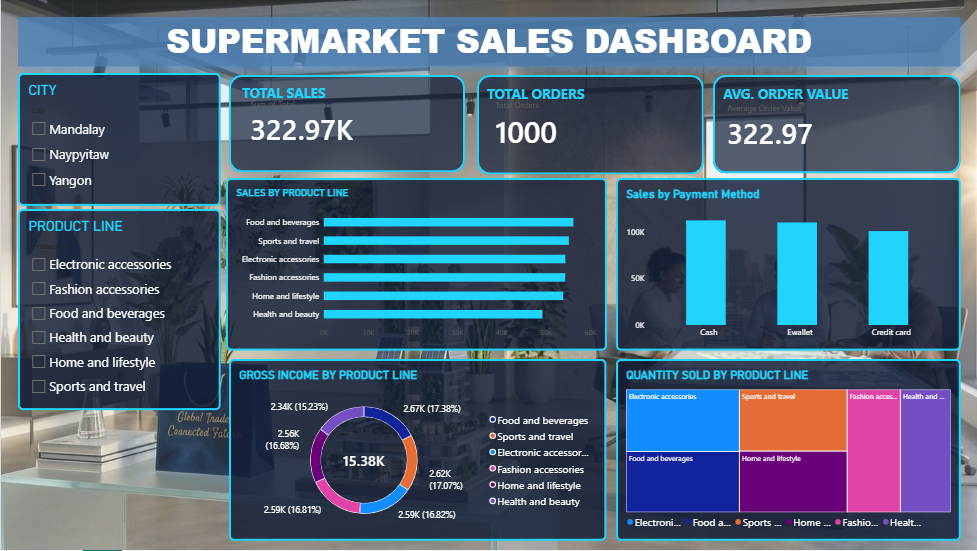

# Practical 10 – Supermarket Sales Dashboard

## Student Details

| Details | Information |
|---|---|
| **Name** | Mayuri Narsu Patil |
| **Roll No.** | 63 |
| **Class** | T.Y.D.S |
| **Subject** | Data Science |
| **Academic Year** | 2026–27 |

---

## Aim

To build an end-to-end data engineering pipeline for supermarket sales data and create an interactive Power BI dashboard for analyzing business performance and generating meaningful insights.

---

## Project Title

**Supermarket Sales Dashboard**

---

## Project Overview

This project focuses on processing and analyzing supermarket sales data and presenting the results through an interactive Power BI dashboard.

The dashboard helps to understand sales, profit, orders, product categories, regional performance, shipping performance, and overall business trends.

---

## Data Engineering Pipeline

**Raw Dataset → Data Ingestion → Data Cleaning → Data Transformation → Data Analysis → Power BI Dashboard**

---

## Technologies Used

- Python
- Pandas
- SQL
- Power Query
- Power BI
- DAX
- GitHub

---

## Data Processing

The dataset was prepared for analysis using the following steps:

1. Data ingestion
2. Data cleaning
3. Handling missing and inconsistent data
4. Data transformation
5. Data preparation
6. Sales and profit analysis
7. Loading the processed data into Power BI

---

## Dashboard Preview

---

## Dashboard

The **Supermarket Sales Dashboard** provides an interactive view of business performance.

### Key Performance Indicators

- **Total Sales:** 36.78M
- **Total Profit:** 3.97M
- **Total Orders:** 66K
- **Delay %:** 0.57
- **Profit Margin %:** 0.12

### Dashboard Analysis

The dashboard contains visualizations for:

- Sales Trend
- Profit Trend
- Sales by Region
- Profitability by Category
- Delivery Performance by Shipping Mode
- Product Category Analysis
- Year-wise Analysis
- Region-wise Analysis

Interactive filters and slicers are provided to explore the data according to different years, regions, and product categories.

---

## Project Files

| File | Description |
|---|---|
| `Supermarket_Sales_Dashboard.pbix` | Interactive Power BI dashboard |
| `Data_Engi_prac10.pdf` | Practical 10 documentation |
| `Dashboard.png` | Dashboard preview image |

---

## Learning Outcomes

Through this practical, I learned how to:

- Build an end-to-end data engineering workflow.
- Clean and transform raw sales data.
- Perform data analysis.
- Create calculated measures using DAX.
- Design interactive Power BI dashboards.
- Use visualizations to identify business trends.
- Present data-driven insights effectively.

---

## Result

Successfully developed an interactive **Supermarket Sales Dashboard** using Power BI to analyze sales, profit, orders, product categories, regional performance, and delivery performance.

---

## Conclusion

The project demonstrates how raw supermarket sales data can be transformed into useful business insights through data cleaning, transformation, analysis, and interactive Power BI visualization.

---

**Created by:** Mayuri Narsu Patil  